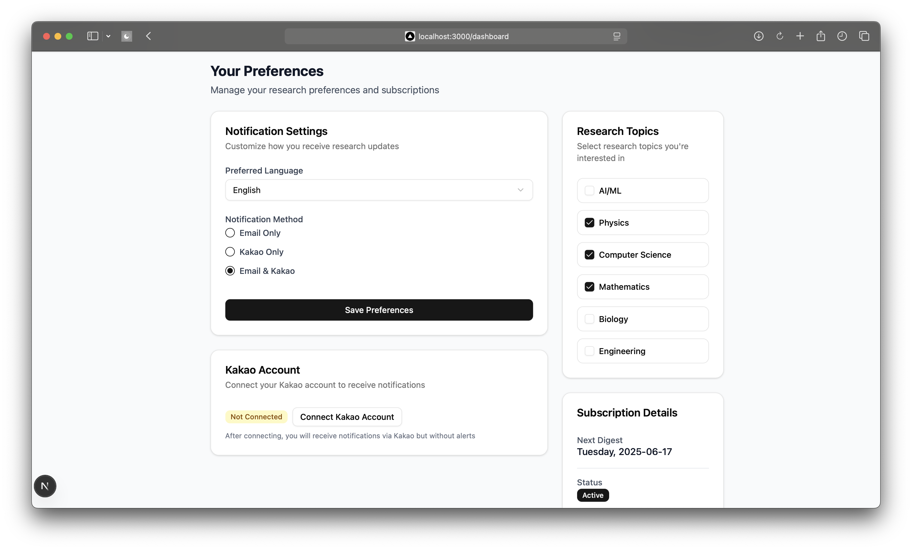

# INSTWAVE Research Digest System

## Project Overview

INSTWAVE is an AI-powered research paper digest platform that delivers personalized summaries of recent academic publications directly to users. The system automatically collects papers from arXiv, generates AI summaries, and sends weekly digests based on user preferences. Users can subscribe to topics, choose notification methods, and receive updates in their preferred language.

## Key Features

- **Automated Paper Collection**: Daily arXiv crawler captures latest research papers
- **AI-Powered Summarization**: GPT-3.5 generates concise summaries with key insights
- **Personalized Digests**: Users receive weekly updates matching their interests
- **Multi-Platform Notifications**: Email and KakaoTalk delivery options
- **Bilingual Support**: English and Korean interfaces and content
- **User Dashboard**: Manage preferences, topics, and notification settings
- **Manual Digest Trigger**: Send current week's digest immediately
- **Kakao Integration**: Connect Kakao account for direct messaging

## Technology Stack

### Backend

- **Framework**: Flask (Python)
- **Database**: PostgreSQL (user data), Firestore (raw paper storage)
- **Scheduling**: Flask-APScheduler
- **AI Services**: OpenAI API (summarization, translation)
- **Email Service**: Resend API
- **Authentication**: Session-based with password hashing
- **APIs**: RESTful endpoints for frontend communication

### Frontend

- **Framework**: Next.js 15 with App Router
- **Language**: TypeScript
- **Styling**: Tailwind CSS
- **UI Components**: shadcn/ui
- **State Management**: React Context API
- **Routing**: Next.js Navigation

### Infrastructure

- **Cloud Storage**: Google Cloud Storage (GCS)
- **Task Scheduling**: Cloud Scheduler
- **Database Hosting**: Google Cloud SQL (PostgreSQL)

## Database Schema (PostgreSQL)

### Users

```sql
CREATE TABLE users (
    id BIGSERIAL PRIMARY KEY,
    email VARCHAR NOT NULL UNIQUE,
    name VARCHAR NOT NULL,
    password_hash TEXT NOT NULL,
    language VARCHAR(2) DEFAULT 'en',
    notification_method VARCHAR(10) DEFAULT 'email',
    active BOOLEAN DEFAULT TRUE,
    created_at TIMESTAMPTZ DEFAULT NOW(),
    updated_at TIMESTAMPTZ DEFAULT NOW()
);

```

### Topics

```sql
CREATE TABLE topics (
    id BIGSERIAL PRIMARY KEY,
    label VARCHAR NOT NULL UNIQUE
);

```

### User Topics

```sql
CREATE TABLE user_topics (
    id BIGSERIAL PRIMARY KEY,
    user_id BIGINT REFERENCES users(id) ON DELETE CASCADE,
    topic_id BIGINT REFERENCES topics(id) ON DELETE CASCADE
);

```

### Research Papers

```sql
CREATE TABLE thesis (
    id BIGSERIAL PRIMARY KEY,
    arxiv_id VARCHAR UNIQUE,
    title VARCHAR NOT NULL,
    author VARCHAR NOT NULL,
    content TEXT,
    ai_summary TEXT,
    publish_date DATE,
    categories TEXT[],
    created_at TIMESTAMPTZ DEFAULT NOW(),
    updated_at TIMESTAMPTZ DEFAULT NOW()
);

```

### ArXiv Category Mapping

```sql
CREATE TABLE arxiv_category_mapping (
    arxiv_category VARCHAR PRIMARY KEY,
    topic_id BIGINT REFERENCES topics(id) ON DELETE CASCADE
);

```

### Kakao Tokens

```sql
CREATE TABLE kakao_tokens (
    user_id INTEGER PRIMARY KEY REFERENCES users(id) ON DELETE CASCADE,
    access_token TEXT NOT NULL,
    refresh_token TEXT,
    expires_at DOUBLE PRECISION NOT NULL,
    created_at TIMESTAMP DEFAULT CURRENT_TIMESTAMP,
    updated_at TIMESTAMP DEFAULT CURRENT_TIMESTAMP
);

```

## Project Structure

```
INSTWAVE/
├── server(backend)/                  # Flask application
│   ├── app.py                # Main application entry point
│   ├── config.py             # Configuration settings
│   ├── scheduler.py          # Task scheduling manager
│   ├── requirements.txt      # Python dependencies
│   ├── init_db.py            # Database initialization script
│   ├── services/             # Core application services
│   │   ├── core_services.py  # Authentication, content generation, notifications
│   │   └── database.py       # Database operations
│   └── templates/            # Email templates
│       └── email_base.html   # Base email template
│
└── web(frontend)/                 # Next.js application
    ├── app/                  # App router directory
    │   ├── login/            # Login page
    │   │   └── page.tsx
    │   ├── register/         # Registration page
    │   │   └── page.tsx
    │   ├── dashboard/        # User dashboard
    │   │   └── page.tsx
    │   ├── layout.tsx        # Root layout
    │   └── page.tsx          # Home page redirect
    ├── components/           # Reusable components
    │   ├── ui/               # shadcn/ui components
    │   ├── AppHeader.tsx     # Application header
    │   └── Logo.tsx          # Brand logo
    ├── context/              # Application contexts
    │   ├── AuthContext.tsx   # Authentication context
    │   └── LanguageContext.tsx # Language context
    ├── services/             # API services
    │   └── api.ts            # API client
    └── lib/                  # Utility functions
        └── utils.ts          # Helper functions

```

## Getting Started

### Prerequisites

- Node.js 18+
- Python 3.9+
- PostgreSQL 15+
- Firebase account (for Firestore)
- Resend API key
- OpenAI API key
- Kakao Developers account

### Installation

1. **Clone repository**

```bash
git clone <https://github.com/dogukanatar/insightwave251.git>
cd insightwave251

```

1. **Backend setup**

```bash
cd server
python -m venv venv
source venv/bin/activate
pip install -r requirements.txt

```

1. **Frontend setup**

```bash
cd ../web
npm install

```

1. **Environment configuration**
Create `.env` files in both backend and frontend directories with required keys:

**Server / .env**

```
DB_HOST=your_db_host
DB_NAME=your_db_name
DB_USER=your_db_user
DB_PASSWORD=your_db_password
RESEND_API_KEY=your_resend_key
OPENAI_API_KEY=your_openai_key
KAKAO_CLIENT_ID=your_kakao_client_id
KAKAO_REDIRECT_URI=your_kakao_redirect_url
SECRET_KEY=your_secret_key

```

**Web / .env.local**

```
NEXT_PUBLIC_BACKEND_URL=your_be_url

```

## Initialize the Database

Run the following command to create the required database tables:

```bash
cd server
python init_db.py

```

This script will create the following tables in your PostgreSQL database:

1. **users**:
    - `id` (SERIAL PRIMARY KEY)
    - `email` (VARCHAR(255), UNIQUE, NOT NULL)
    - `name` (VARCHAR(255), NOT NULL)
    - `language` (VARCHAR(2))
    - `notification_method` (VARCHAR(10))
    - `password_hash` (VARCHAR(255), NOT NULL)
    - `active` (BOOLEAN)
    - `created_at` (TIMESTAMPTZ)
2. **topics**:
    - `id` (SERIAL PRIMARY KEY)
    - `label` (VARCHAR(255), UNIQUE, NOT NULL)
3. **thesis** (research papers):
    - `id` (SERIAL PRIMARY KEY)
    - `arxiv_id` (VARCHAR(255), UNIQUE)
    - `title` (VARCHAR(500), NOT NULL)
    - `author` (VARCHAR(500), NOT NULL)
    - `summary` (TEXT)
    - `ai_summary` (TEXT)
    - `publish_date` (DATE)
    - `categories` (TEXT[])
4. **arxiv_category_mapping**:
    - `arxiv_category` (VARCHAR(50), PRIMARY KEY)
    - `topic_id` (INTEGER, REFERENCES topics(id))
5. **user_topics**:
    - `id` (SERIAL PRIMARY KEY)
    - `user_id` (INTEGER, REFERENCES users(id))
    - `topic_id` (INTEGER, REFERENCES topics(id))
6. **kakao_tokens**:
    - `user_id` (INTEGER, PRIMARY KEY REFERENCES users(id))
    - `access_token` (TEXT, NOT NULL)
    - `refresh_token` (TEXT)
    - `expires_at` (DOUBLE PRECISION, NOT NULL)

## Running the Application

1. **Initialize the database** (first time setup only):

```bash
cd server
python init_db.py

```

1. **Start backend**

```bash
source venv/bin/activate
python app.py

```

1. **Start frontend**

```bash
cd ../web
npm run dev

```

1. **Access application**
Open `http://localhost:3000` in your browser

## Usage Guide

### 1. Accessing the Application

1. Open your web browser and navigate to the application URL
2. You'll be automatically redirected to the login page
    
    

### 2. Switching Language

1. In the top-right corner of any page, locate the language dropdown
2. Select your preferred language:
    - English
    - 한국어 (Korean)
3. The entire interface will instantly update to your selected language
    
    

### 3. Creating an Account

1. From the login page, click "New user? Create account"
2. Fill in the registration form:
    - Full name
    - Valid email address
    - Password (8-20 characters with letters and numbers)
3. Select at least 1 research topic that interests you
4. Click "Register" to create your account
5. You'll be automatically logged in and redirected to your dashboard
    
    

### 4. Logging In

1. Enter your registered email address
2. Type your password
3. Click "Login"
4. You'll be redirected to your personalized dashboard
    
    

### 5. Managing Preferences

1. On your dashboard, configure your settings:
    - **Preferred Language**: English or Korean
    - **Notification Method**: Email, Kakao, or both
    - **Research Topics**: Select topics you want to follow
    - **Notification Status**: Activate/deactivate weekly digests
2. Click "Save Preferences" to apply changes
    
    

### 6. Connecting Kakao

1. In Notification Settings, click "Connect Kakao Account"
    
    
2. Authorize INSTWAVE to send you notifications
    
    
3. You'll be redirected back to your dashboard
4. Kakao status will show "Connected"

### 7. Receiving Research Digests

- **Automatic Delivery**: Every Tuesday at 8:00 AM KST
- **Manual Delivery**: Click "Send Weekly Digest Now" to receive current papers immediately
- **Delivery Methods**: Receive via email, Kakao, or both based on your preferences
    
    

### 8. Testing Notifications

1. In Subscription Details, click "Send Weekly Digest Now"
2. Check your selected notification methods:
    - Email inbox
    - KakaoTalk messages
3. You'll receive the latest papers in your selected topics
    
    

### 9. Logging Out

1. Click "Logout" in the top-right corner
2. You'll be securely logged out and redirected to the login page
    
    

### 10. Troubleshooting

- If notifications don't arrive:
    1. Check your spam folder
    2. Verify notification status is "Active"
    3. Ensure you've selected at least 1 research topic
- If Kakao connection fails:
    1. Ensure you authorized all permissions
    2. Try reconnecting from the dashboard
    3. Verify your Kakao app notification settings

## Scheduled Tasks

The system runs the following automated tasks:


1. **Daily Crawling** (12:00 PM KST): 
    - Crawls papers published the previous day
    - On Tuesdays, additionally crawls weekend papers between 12:00-2:00 PM

1. **Weekly AI summary generation** (Tuesday 7:00 AM KST):
    - Fetches new papers from arXiv
    - Generates AI summaries for each paper
    - Stores summaries in the database

2. **Weekly notification dispatch** (Tuesday 8:00 AM KST):
    - Prepares personalized digests for all active users
    - Sends emails and/or Kakao messages based on preferences
    - Logs all delivery attempts and results

